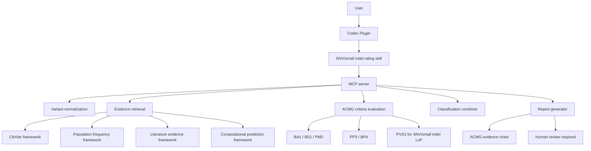
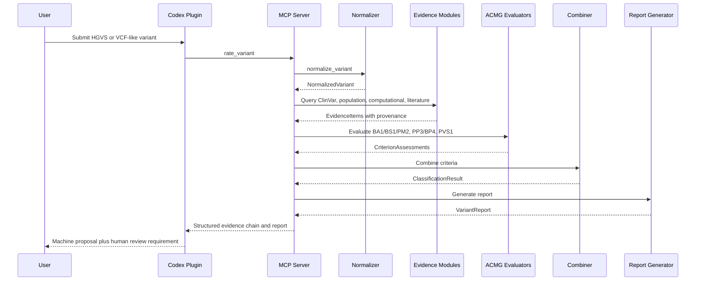

# Architecture

## Scope

Variant Pathogenicity Rater is a Codex Plugin plus MCP server architecture for
single-variant ACMG interpretation of SNV and small indel variants.

The first phase supports:

- SNV and small indel only
- Single variant rating only
- HGVS and VCF-like input
- ACMG evidence chain output
- Five-tier ACMG classification:
  - Pathogenic
  - Likely pathogenic
  - VUS
  - Likely benign
  - Benign
- Auditable evidence provenance
- Mandatory human review notice for every conclusion

The first phase explicitly does not implement:

- CNV
- SV
- DMD complex SV
- Repeat expansion
- Mitochondrial variant interpretation
- Methylation evidence
- RNA-seq evidence
- Long-read evidence

Future CNV/SV support may be added by introducing new variant types, evidence
providers, and ACMG rule profiles, but those paths are not part of the MVP.

## High-Level Architecture

## Architectural Layers

### Codex Plugin

The plugin is the user-facing layer. It provides the workflow, prompts, report
templates, and MCP server connection. It should not contain ACMG business logic.

Primary responsibilities:

- Accept user intent and variant input
- Call MCP tools
- Present structured evidence chains
- Present machine-proposed classification
- Require human review before any final use

### MCP Server

The MCP server is the stable integration boundary for all domain operations.
Every auditable action should be represented as a tool call.

Primary responsibilities:

- Validate tool input
- Orchestrate the rating workflow
- Call normalization, evidence, ACMG, combiner, and reporting modules
- Return structured Pydantic-derived responses
- Preserve evidence provenance in outputs

### Schemas

Schemas are Pydantic v2 models for all major data contracts.

Primary responsibilities:

- Define variant input and normalized variant objects
- Define evidence items and provenance
- Define ACMG criterion assessments
- Define classification and report objects
- Restrict current variant scope to SNV and small indel

### Normalization

Normalization converts HGVS or VCF-like input into a canonical internal
representation.

Primary responsibilities:

- Parse HGVS input
- Parse VCF-like input
- Validate genome build
- Identify SNV versus small indel
- Reject unsupported variant categories in phase 1
- Preserve normalization warnings

### Evidence Retrieval

Evidence retrieval modules adapt external or local sources into standard
EvidenceItem records. They do not make final ACMG classification decisions.

Primary responsibilities:

- Retrieve ClinVar evidence
- Retrieve population frequency evidence
- Retrieve computational prediction evidence
- Retrieve candidate literature evidence
- Attach source, query, timestamp, version, and raw snapshot metadata

### ACMG Criteria Evaluation

Criteria evaluators transform evidence into candidate ACMG criterion
assessments.

Phase 1 criteria:

- BA1
- BS1
- PM2
- PP3
- BP4
- PVS1 for SNV/small indel loss-of-function variants

Evaluators should return structured assessments, not final clinical assertions.

### Classification Combiner

The combiner applies ACMG combination logic to criterion assessments and returns
a five-tier machine proposal.

Primary responsibilities:

- Combine pathogenic and benign criteria
- Detect conflicts
- Handle insufficient evidence as VUS
- Return a machine-proposed classification
- Always mark human review as required

### Report Generator

The report generator renders the structured result.

Phase 1 outputs:

- JSON report
- Markdown report
- Evidence chain table
- Human review checklist

## Design Principles

- All conclusions are machine proposals and require human review.
- Every criterion must link to supporting evidence IDs.
- Every evidence item must include provenance.
- Evidence retrieval is separate from ACMG rule application.
- ACMG rule application is separate from classification combining.
- Current code paths must reject out-of-scope variant types rather than silently
  attempting interpretation.
- Future CNV/SV support should extend the model without changing SNV/small indel
  contracts.

## Proposed Runtime Flow

